# Introduction to Container Technology
<!-- TOC -->

- [Introduction to Container Technology](#introduction-to-container-technology)
  - [Setup](#setup)
  - [Sample Knative Serving](#sample-knative-serving)
  - [Sample Knative Function](#sample-knative-function)
  - [Sample Knative Eventing](#sample-knative-eventing)

<!-- /TOC -->

## Setup

- install Red Hat OpenShift Serverless Operator (all namespace)
  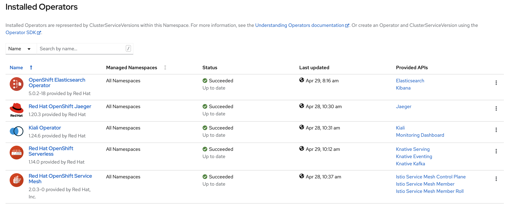
- install Knative Serving
  - create project knative-serving
    ```bash
    $ oc new-project knative-serving
    ```
  - go to installed Operators, Red Hat OpenShift Serverless, Knative Serving, Click Create Knative Serving
    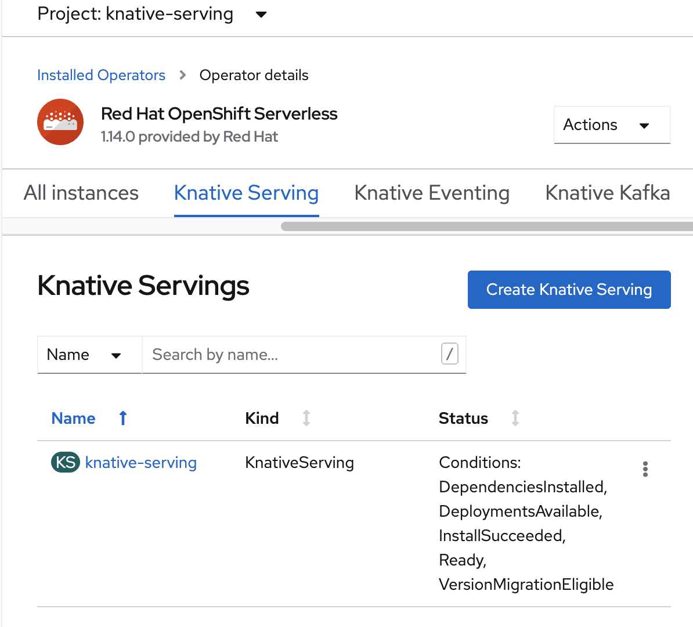
  - Create Knative Serving
    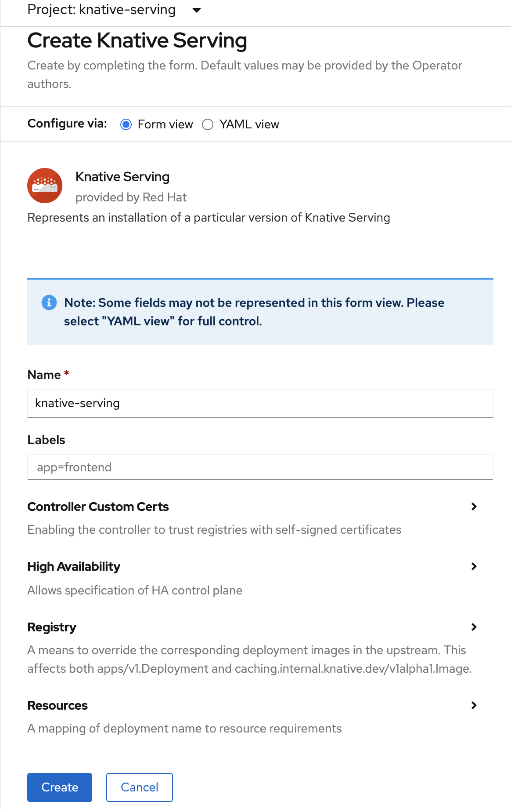
  - wait until all conditions true
    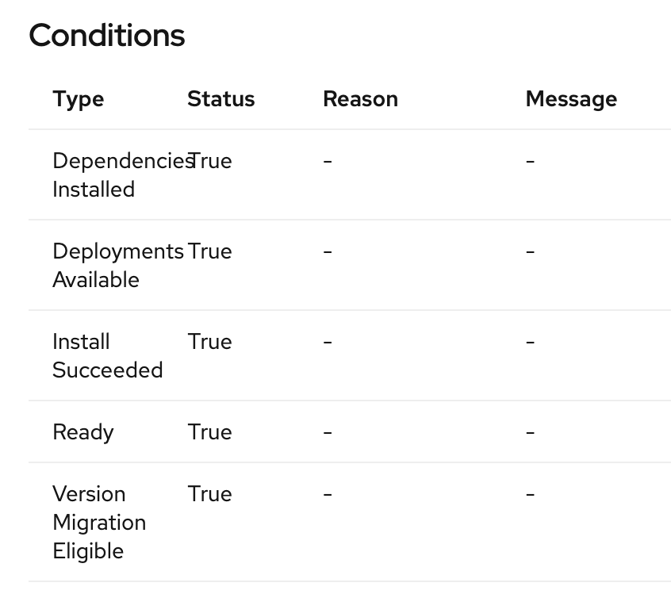
- install Knative Eventing
  - create project knative-eventing
    ```bash
    oc new-project knative-eventing
    ```
  - go to installed Operators, Red Hat OpenShift Serverless, Knative Eventing, Click Create Knative Eventing
    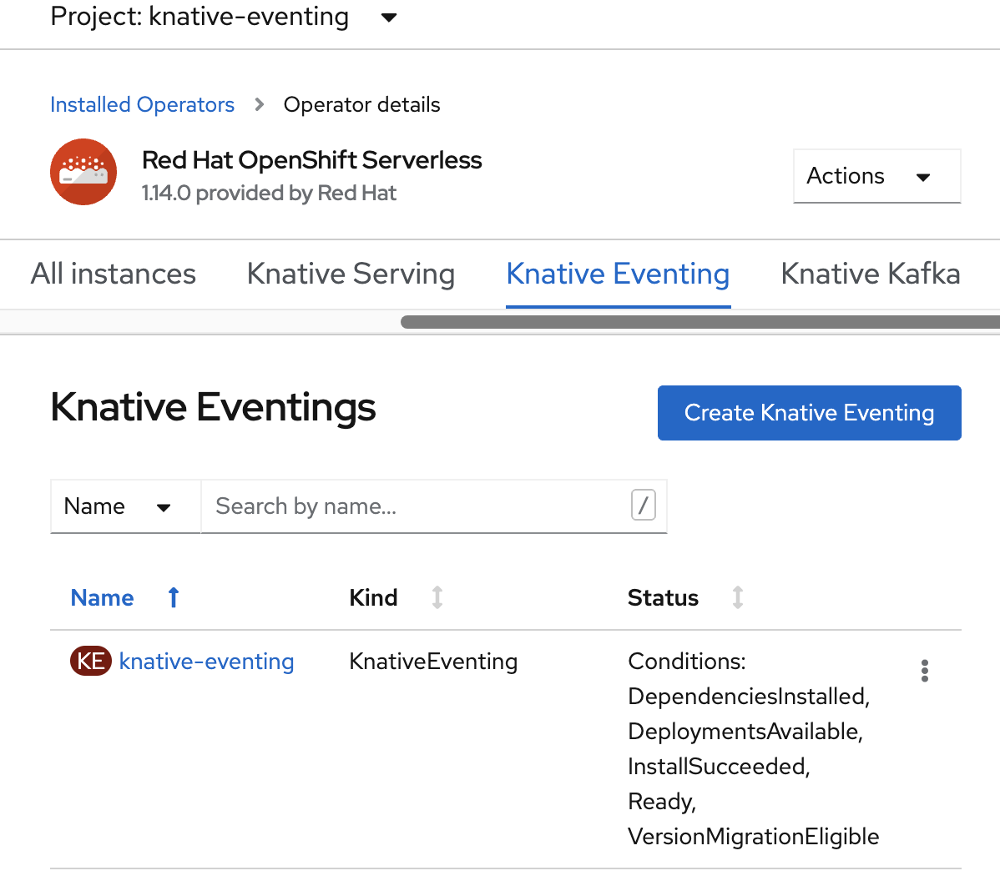
  - Create Knative Serving
    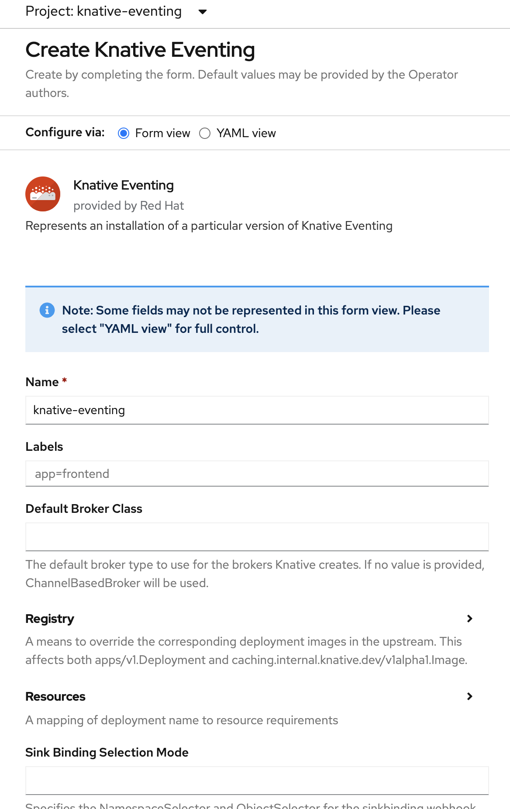
  - wait until all conditions true
- install Knative Kafka (WIP)
- install Knative CLI
  - https://knative.dev/development/client/install-kn/
  - check kn
  ```bash
  $ kn version
    Version:      v0.20.0
    Build Date:   2021-04-15 02:53:20
    Git Revision: 5b60a4b7
    Supported APIs:
    * Serving
    - serving.knative.dev/v1 (knative-serving v0.20.0)
    * Eventing
    - sources.knative.dev/v1alpha2 (knative-eventing v0.20.0)
    - eventing.knative.dev/v1beta1 (knative-eventing v0.20.0)
  $ kn
    kn is the command line interface for managing Knative Serving and Eventing resources

    Find more information about Knative at: https://knative.dev

    Serving Commands:
    service      Manage Knative services
    revision     Manage service revisions
    route        List and describe service routes

    Eventing Commands:
    source       Manage event sources
    broker       Manage message brokers
    trigger      Manage event triggers
    channel      Manage event channels
    subscription Manage event subscriptions

    Other Commands:
    plugin       Manage kn plugins
    completion   Output shell completion code
    version      Show the version of this client

    Plugins:
    func        Function plugin


    Use "kn <command> --help" for more information about a given command.
    Use "kn options" for a list of global command-line options (applies to all commands).
  ```

## Sample Knative Serving
- create project test-serving
- test deploy Knative with image from docker hub (quarkus)
  ```bash
  $ oc new-project test-serving
  $ kn service create event-display-kn --image danielon30/quarkus-serverless:latest
  Creating service 'event-display-kn' in namespace 'test-serving':

  0.012s The Configuration is still working to reflect the latest desired specification.
  0.073s The Route is still working to reflect the latest desired specification.
  0.120s Configuration "event-display-kn" is waiting for a Revision to become ready.
  6.806s ...
  6.807s Ingress has not yet been reconciled.
  6.847s Waiting for load balancer to be ready
  7.114s Ready to serve.

  Service 'event-display-kn' created to latest revision 'event-display-kn-mvjwn-1' is available at URL:
  http://event-display-kn-test-serving.apps.cluster-61c3.61c3.sandbox1689.opentlc.com
  ```
  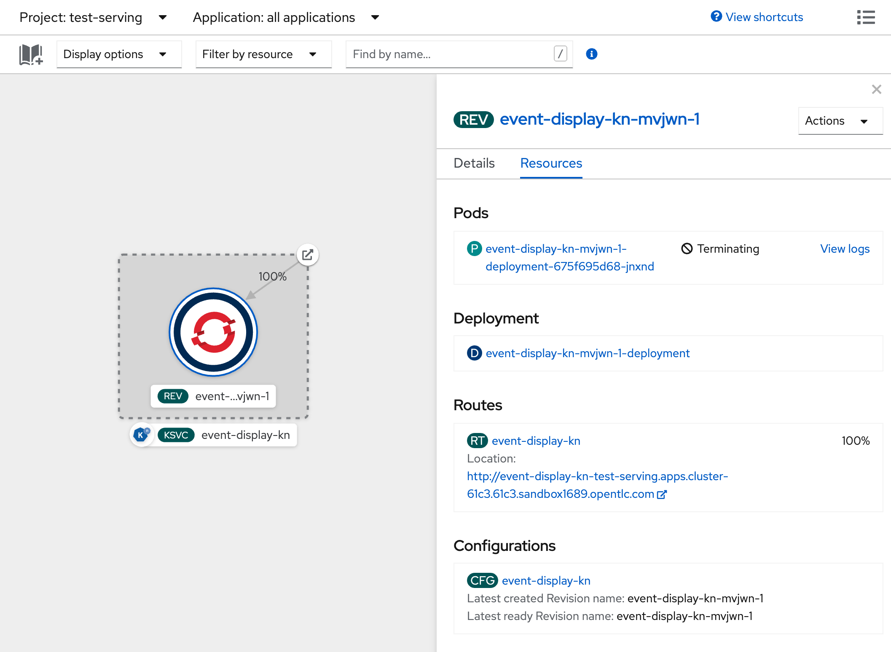

## Sample Knative Function
- create knative function with kn cli
```bash
$ cd test-faas
$ kn func create -l node
Project path: /Users/ckongman/work/workspace/serverless/test-faas
Function name: test-faas
Runtime: node
Trigger: http
$ ll
total 216
-rw-r--r--  1 ckongman  staff   2.0K Apr 30 13:19 README.md
-rw-r--r--  1 ckongman  staff   196B Apr 30 13:19 func.yaml
-rw-r--r--  1 ckongman  staff   1.4K Apr 30 13:19 index.js
-rw-r--r--  1 ckongman  staff    91K Apr 30 13:19 package-lock.json
-rw-r--r--  1 ckongman  staff   544B Apr 30 13:19 package.json
drwxr-xr-x  4 ckongman  staff   128B Apr 30 13:19 test
```
- create test-faas project
```bash
$ oc new-project test-faas
```
- deploy to openshift (up container to dockerhub, please provide docker & login)
```bash
$ kn func deploy -n test-faas
A registry for Function images is required. For example, 'docker.io/tigerteam'.

Registry for Function images: docker.io/chatapazar
Building function image
Function image has been built, image: docker.io/chatapazar/test-faas:latest
Pushing function image to the registry
Username: chatapazar
Password: Deploying function to the cluster
Function deployed at URL: http://test--faas-test-faas.apps.cluster-61c3.61c3.sandbox1689.opentlc.com
```
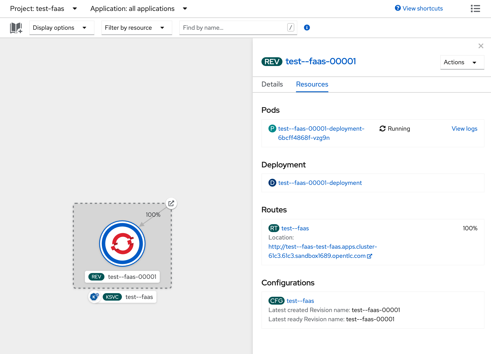

## Sample Knative Eventing
- create knative function with kn cli
```bash
$ cd test-eventing
```
- create test-eventing project
```bash
$ oc new-project test-eventing
```
- create knative eventing project with golang
```bash
$ kn func create -l go -t events
Project path: /Users/ckongman/work/workspace/serverless/test-eventing
Function name: test-eventing
Runtime: go
Trigger: events

$ kn func deploy -n test-eventing
A registry for Function images is required. For example, 'docker.io/tigerteam'.

Registry for Function images: docker.io/chatapazar
Building function image
Function image has been built, image: docker.io/chatapazar/test-eventing:latest
Pushing function image to the registry
Username: chatapazar
Password: Deploying function to the cluster
Function deployed at URL: http://test--eventing-test-eventing.apps.cluster-61c3.61c3.sandbox1689.opentlc.com
```
- create channel
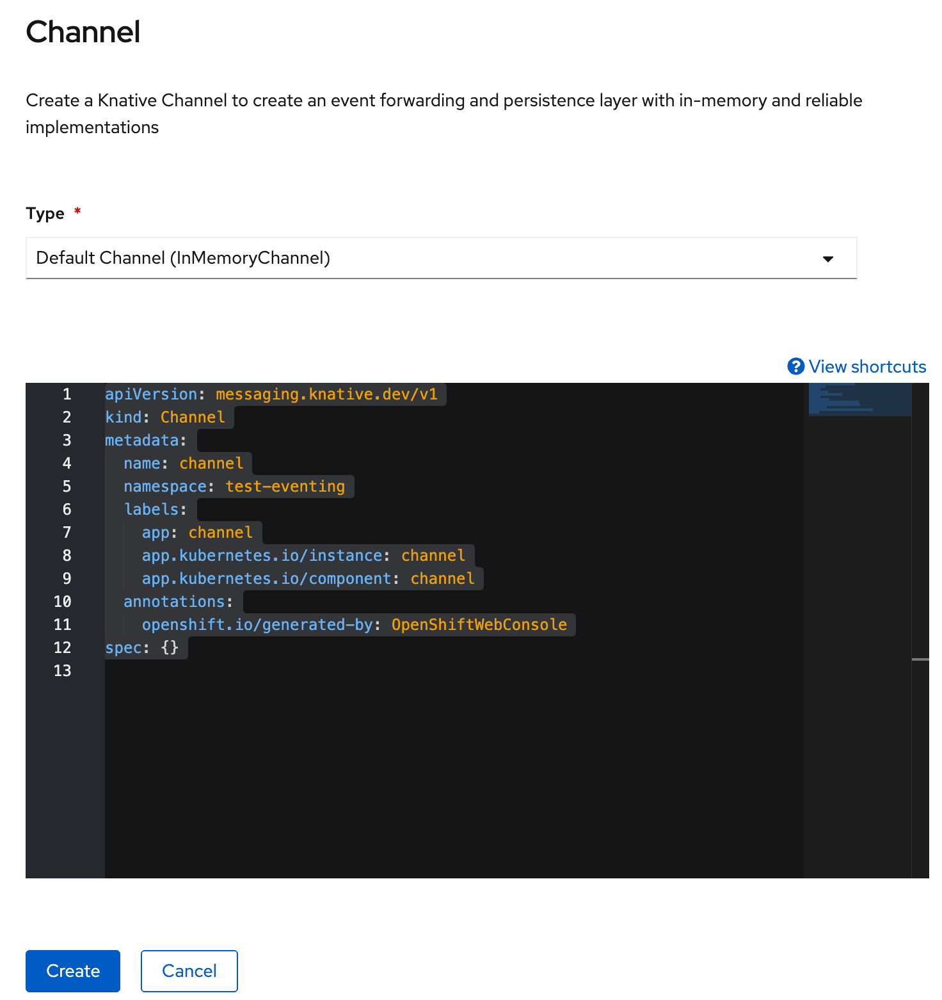
- create event source (ping source)
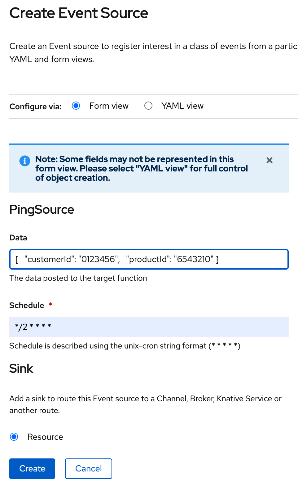
- after all done
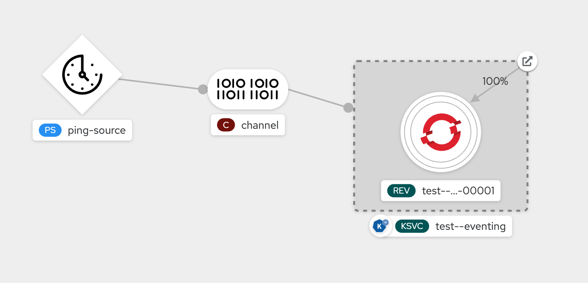